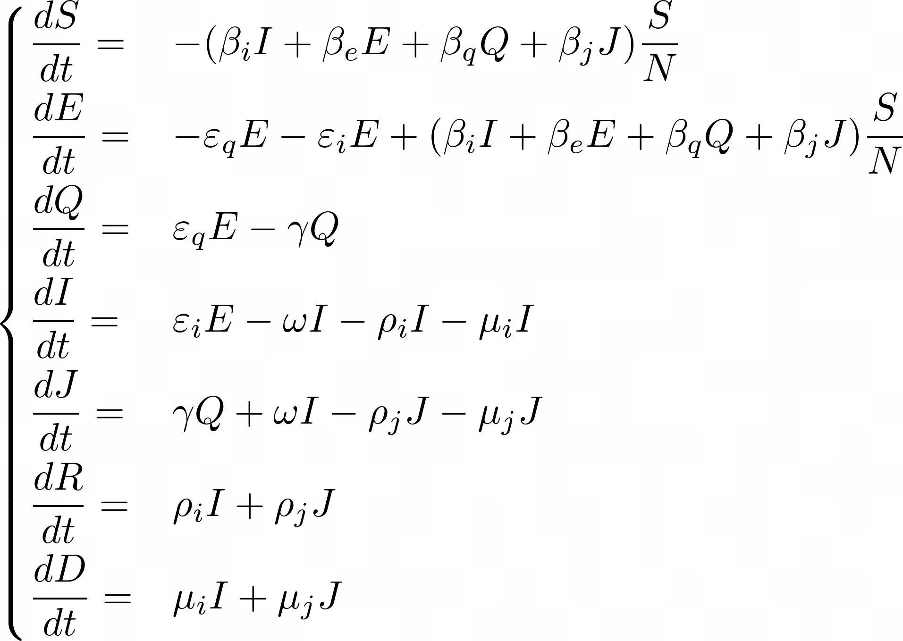

# Epidemic models

## SEIR Model

The SEIR model consists of a chain of the following states for the population:

where the equations that are modeling the transitions:

where the parameters meaning are explained in the following table:

## SEQIJR model of epidemics
The SEQIJR model consists of the following states for the population:

where the equations that are modeling the transitions:

